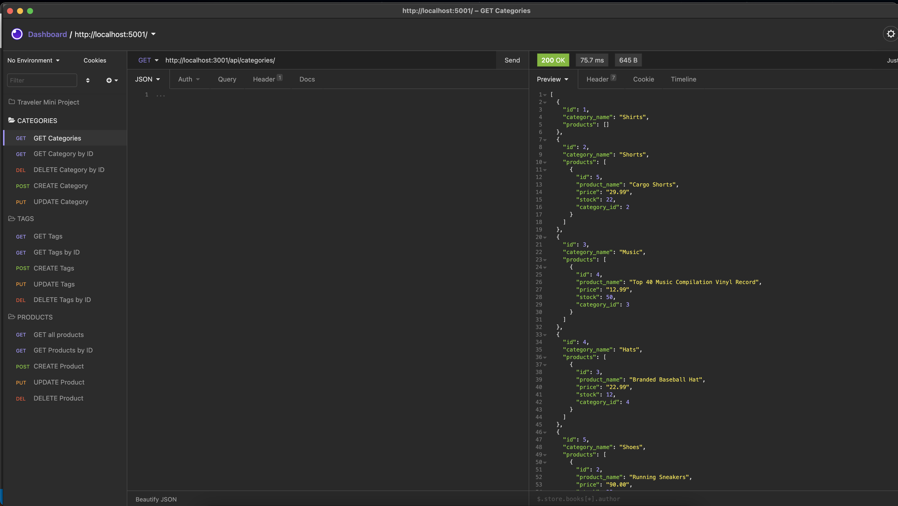

    <h3 align="center">Business_BTS</h3>
     
    

    Master e-commerce back end!
     
     
    <a href="https://youtu.be/FQKySbg7oog">View Demo</a>
    

    
Table of Contents

    <ol>
        <li><a href="#about-the-project">Description</a></li>
        <li><a href="#built-with">Built With</a></li></li>
        <li><a href="#installation">Installation</a></li>
        <li><a href="#usage">Usage</a></li>
        <li><a href="#contributing">Contributing</a></li>
        <li><a href="#license">License</a></li>
        <li><a href="#contact">Contact</a></li>
        <li><a href="#summary">Summary</a></li>
    </ol>

### Description

Business_Behind-The-Scenes is a back end codebase for an e-commerce website. It uses relational databases and ORM to make managing inventories and organizing product data easy and intuitive.

### Built With

Following languages, frameworks and libraries were used in the development of this project:

- JavaScript
-

### Installation

Yes, you will need Node, ExpressJS, MYSQL2, Sequelize as well as Insomnia/Postman to visualize and tes routes and queries.

### Usage

You will need to engineer the front end of your website and then link this code base to it to set up a full web application.

### Contributing

Contributions are what make the open source community such an amazing place to learn, inspire, and create. Any contributions you make are **greatly appreciated**.

1. Fork the Project
2. Create your Feature Branch
3. Commit your Changes
4. Push to the Branch
5. Open a Pull Request

### License

This project is using the following license: MIT

### Contact

You can reach me for any questions or comments at the following:

- Look me up on Github, where my username is <a href="https://github.com/wdfhai">wdfhai</a>.
- Reach out to me through email at wd.fhai@gmail.com.
- Find me on Twitter at @wdfhai.

### Summary

Thank you for checking out my e-commerce back end code. Cheers!
